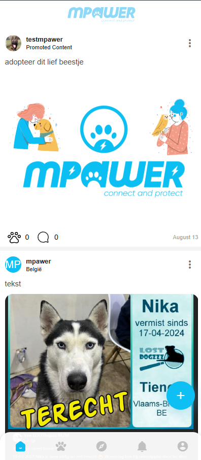
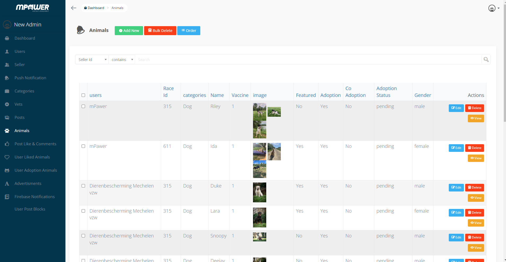
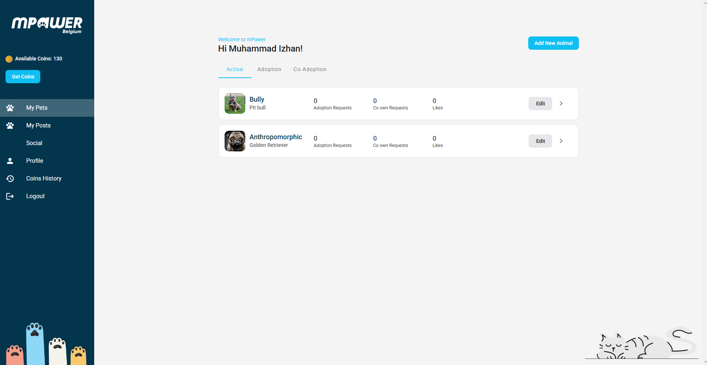

# Mpawer

Mpawer is a pet-focused platform built with Laravel 7, Vue.js, and a native mobile app. It provides a seamless experience for pet lovers, sellers, and administrators. The platform enables users to explore pet-related posts (similar to Instagram), request pet adoptions, and locate nearby vets through an interactive map.

## Preview

---

## 🛠 Tech Stack & Versions

- **Backend:** Laravel 7, PHP 7.4
- **Frontend:** Vue.js
- **Mobile App:** Native (iOS & Android)
- **Database:** MySQL 5.7
- **Admin Panel:** Voyager
- **Others:** jQuery, JavaScript, GitHub

---

## 📌 Technology Overview

- **Front End:** Vue.js & Native App
- **Back End:** Laravel 7 (PHP 7.4)
- **Admin Panel:** Voyager
- **Database:** MySQL
- **Hosting:** Amazon AWS EC2

---

## 🎯 Features

### **👥 User Features**
- View pet-related posts (Instagram-style feed).
- Request pet adoptions from sellers.
- View nearby vets with an interactive map.
- Sign up/login using email or social accounts.

### **🛍 Seller Features**
- Post pets available for adoption.
- Manage pet adoption requests.
- Engage with users through posts.

### **🛠 Admin Features**
- Manage users, sellers, and pet adoption requests.
- Add, update, or delete veterinarians.
- Integrate Google Maps for vet locations.
- Manage pet-related posts.
- Oversee platform activity via the Voyager Admin Panel.

---

## 🌍 External Integrations
- **Google Maps API** – Display vets’ locations.
- **Facebook & Google Login** – Easy user authentication.
- **AWS EC2** – Hosting.
- **Laravel Vapor** - Serverless for laravel (Backend).
- **Voyager** – Admin panel management.

---

## Developer Information

- **Developer Email:** izhan47@gmail.com
- **Developer Website/Support:** [izhan.me](https://izhan.me)
